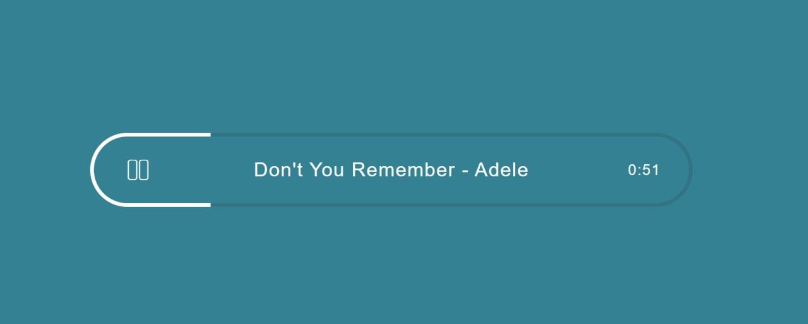

# Custom Mini Audio Player

A customized audio player which can detect the duration and current time and progress of playing songs and show them in custom style b getting help from **Javascript**.

## Features

- Detect duration of an audio song
- Detect the current time of the audio
- Calculate progress of current time
- Play/Resume of audio playing by the `space` key or clicking an icon

**Demo:** https://basemax.github.io/CustomMiniAudioPlayer/

